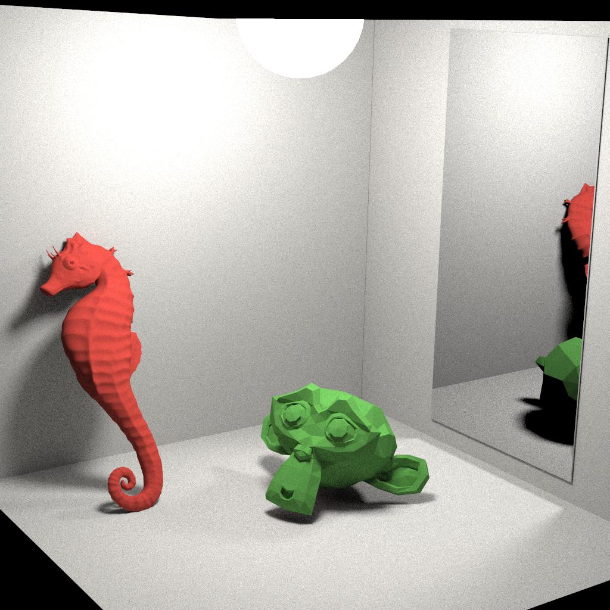

# Physically Based Renderer with Pathtracing Algorithm

A renderer that uses Pathtracing Algorithm to generate cool images from 3D models.

Example:

See more results obtained throughout the development of this tool here: https://github.com/bittencourt-lucas/pbr-results

# Dependencies

This software depends on the following third party software to be compiled:

- glm version 0.9.7.0 or later (http://glm.g-truc.net).
- assimp
- OpenMP

# Compiling and Running

I've compiled and executed this software only in Linux (Ubuntu 18.04).
These are the steps needed in order to compile the program:

1. Install the dependencies (i.e. glm).
2. Download the source code together with the Makefile.
3. Open the Makefile with a text editor (e.g. vim, gedit, etc.).
4. Configure the variables CPPFLAGS and LDFLAGS in order to reflect your glm installations.
5. Save the Makefile.
6. Call 'make DEBUG=0' at the project root directory.
7. Done

To render the hardcoded scene, just issue the following command from the project root directory: 

    $ ./pbr
